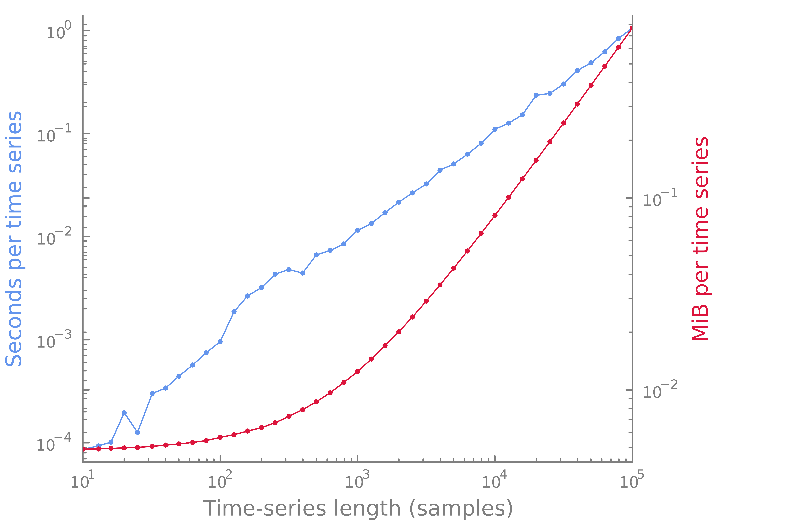
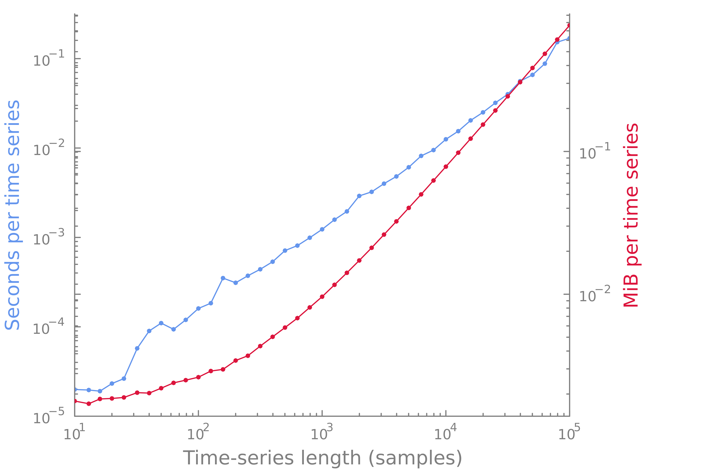

# CatchaMouse16.jl
[](https://brendanjohnharris.github.io/CatchaMouse16.jl/dev)
[](https://github.com/brendanjohnharris/CatchaMouse16.jl/actions/workflows/CI.yml?query=branch%3Amain)
[](https://codecov.io/gh/brendanjohnharris/CatchaMouse16.jl)
[](https://zenodo.org/badge/latestdoi/342070622)
<!--  -->

A Julia package wrapping [_catchaMouse16_](https://www.github.com/dynamicsandneuralsystems/catchaMouse16), which is a set of 16 time-series features shown to be performant in BOLD fMRI time-series classification problems.

The [_catchaMouse16_](https://www.github.com/dynamicsandneuralsystems/catchaMouse16) repository provides these 22 features, originally coded in Matlab as part of the [_hctsa_](https://github.com/benfulcher/hctsa) toolbox, as C functions (in addition to Matlab and Python wrappers). This package simply uses Julia's `ccall` to wrap these C functions from a shared library that is accessed through [catchaMouse16_jll](https://github.com/JuliaBinaryWrappers/catchaMouse16_jll.jl) and compiled by the fantastic [BinaryBuilder](https://github.com/JuliaPackaging/BinaryBuilder.jl) package.

Below we provide a brief getting-started guide to using CatchaMouse16.jl. For more detailed information on the _catchaMouse16_ feature set, such as in-depth descriptions of each feature and a list of publications that use _catchaMouse16_, see the [_catchaMouse16_ wiki](https://time-series-features.gitbook.io/catchaMouse16).

<br>

# Usage
## Installation
```Julia
using Pkg
Pkg.add("CatchaMouse16")
using CatchaMouse16
```

## Input time series
The input time series can be provided as a `Vector{Float64}` or `Array{Float64, 2}`. If an array is provided, the time series must occupy its _columns_. For example, this package contains a few test time series from [_catchaMouse16_](https://www.github.com/dynamicsandneuralsystems/catchaMouse16):
```Julia
𝐱 = CatchaMouse16.testdata[:testSinusoid] # a Vector{Float64}
X = randn(1000, 10) # an Array{Float64, 2} with 10 time series
```

## Evaluating a feature
A list of features (as symbols) can be obtained with `getnames(catchaMouse16)` and their short descriptions with `getdescriptions(catchaMouse16)`. Each feature can be evaluated for a time series array or vector with the `catchaMouse16` `FeatureSet`. For example, the feature `AC_nl_035` can be evaluated using:
```Julia
f = catchaMouse16[:AC_nl_035](𝐱) # Returns a scalar Float64
𝐟 = catchaMouse16[1](X) # Returns a 1×10 Matrix{Float64}
```
All features are returned as Float64's, even though some may be constrained to the integers.

Alternatively, functions that calculate each feature individually are exported. `AC_nl_035` can be evaluated with:
```Julia
f = AC_nl_035(𝐱)
```

## Evaluating a feature set
All _catchaMouse16_ features can be evaluated with:
```Julia
𝐟 = catchaMouse16(𝐱)
F = catchaMouse16(X)
```
If an array is provided, containing one time series in each of N columns, then a 22×N `FeatureArray` of feature values will be returned (a subtype of [AbstractDimArray](https://github.com/rafaqz/DimensionalData.jl)).
A `FeatureArray` has most of the properties and methods of an Array but is annotated with feature names that can be accessed with `getnames(F)`.
If a vector is provided (a single time series) then a vector of feature values will be returned as a `FeatureVector`, a one-dimensional `FeatureArray`.

Finally, note that since `catchaMouse16` is a `FeatureSet` it can be indexed with a vector of feature names as symbols to calculate a `FeatureArray` for a subset of _catchaMouse16_. For details on the `Feature`, `FeatureSet` and `FeatureArray` types check out the package docs.

<br>

# Single-threaded performance
Calculating features for a single time series of a given length:

# Multithreaded performance
Calculating features for 100 time series of a given length:

